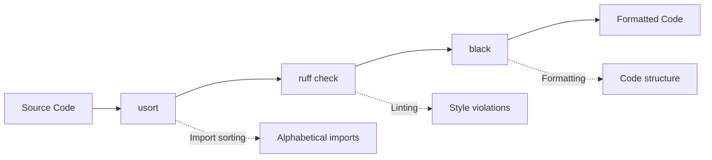
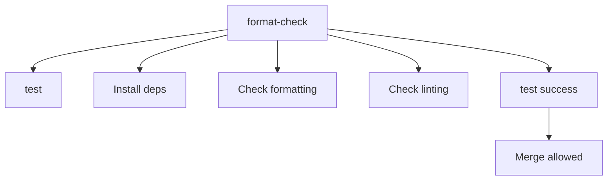

# Code Formatting Guide

This guide covers the comprehensive code formatting and linting setup for TritonParse, ensuring consistent code quality across all contributions.

## 🎨 Formatting Tool Chain

### Primary Tools

| Tool | Purpose | Configuration File |
|------|---------|-------------------|
| **Black** | Code formatting | `pyproject.toml` |
| **usort** | Import sorting | `pyproject.toml` |
| **Ruff** | Linting & style checks | Built-in rules |

### Tool Execution Order



**Why this order?**
1. **usort** - Sorts imports first (affects line numbers)
2. **ruff** - Lints and auto-fixes issues
3. **black** - Final formatting pass

## 📦 Installation

### Quick Setup (Recommended)

```bash
# Install all development dependencies
make install-dev
```

### Manual Installation

```bash
# Install tritonparse in development mode
pip install -e ".[test]"

# Install formatting tools
pip install black usort ruff
```

## 🚀 Usage Commands

### Essential Commands

```bash
# Fix all formatting issues
make format

# Check if code is properly formatted (CI-compatible)
make lint-check

# Check formatting without fixing
make format-check
```

### Advanced Commands

```bash
# Verbose formatting (see all changes)
python -m tritonparse.tools.format_fix --verbose

# Check-only mode (no modifications)
python -m tritonparse.tools.format_fix --check-only

# Run individual tools
usort format .          # Sort imports
ruff check . --fix      # Fix linting issues
black .                 # Format code
```

## ⚙️ Configuration

### pyproject.toml

```toml
[tool.black]
line-length = 88
target-version = ["py310"]

[tool.usort]
first_party_detection = false
```

### Makefile

```makefile
# Development dependencies
install-dev:
    pip install -e ".[test]"
    pip install black usort ruff

# Formatting commands
format:
    python -m tritonparse.tools.format_fix --verbose

format-check:
    python -m tritonparse.tools.format_fix --check-only --verbose

# Linting commands  
lint-check:
    ruff check --diff .
    black --check --diff .
```

## 🔧 Developer Workflow

### Development Workflow

```bash
# 1. Make your code changes
# 2. Run formatting
make format

# 3. Verify everything is clean
make lint-check

# 4. Commit your changes
git add .
git commit -m "Your changes"
```

### Fixing Format Issues

If `make lint-check` fails:

```bash
# Run the formatter
make format

# Check if issues are resolved
make lint-check

# If still failing, check the diff
ruff check --diff .
black --check --diff .
```

### Automated Quality Checks

The project uses GitHub Actions to automatically check code formatting on every push and pull request. This ensures consistent code quality across all contributions.

```bash
# Manual quality check before pushing
make format-check
make lint-check
```

## 🤖 CI Integration

### GitHub Actions Workflow

The CI pipeline includes a `format-check` job that:

1. **Installs dependencies** via `make install-dev`
2. **Checks formatting** via `make format-check` 
3. **Verifies linting** via `make lint-check`
4. **Blocks merging** if formatting fails

```yaml
format-check:
  runs-on: ubuntu-latest
  steps:
    - uses: actions/checkout@v4
    - name: Set up Python 3.11
      uses: actions/setup-python@v4
      with:
        python-version: "3.11"
    - name: Install development dependencies
      run: make install-dev
    - name: Check code formatting
      run: make format-check
    - name: Check linting
      run: make lint-check
```

### Dependency Chain



## 🔍 Tool Details

### Black (Code Formatter)

**Configuration**:
- Line length: 88 characters
- Target: Python 3.10+
- Style: Black default (PEP 8 compliant)

**What it formats**:
- Code structure and spacing
- String quotes (double quotes preferred)
- Line breaks and indentation
- Trailing commas

**Example**:
```python
# Before
def my_function(x,y,z):
    return x+y+z

# After
def my_function(x, y, z):
    return x + y + z
```

### usort (Import Sorter)

**Configuration**:
- First-party detection: Disabled
- Sorting: Alphabetical within categories
- Categories: Standard library, third-party, local

**What it sorts**:
- Import statements
- From imports
- Import grouping

**Example**:
```python
# Before
import triton
import os
import torch
from pathlib import Path

# After
import os
from pathlib import Path

import torch
import triton
```

### Ruff (Linter)

**Configuration**:
- Rules: Built-in defaults
- Auto-fix: Enabled for safe fixes
- Purpose: Linting only (no formatting)

**What it checks**:
- Code style violations
- Unused imports
- Syntax errors
- Type annotation issues

**Example**:
```python
# Before - Ruff will flag unused import
import os
import sys  # unused

def hello():
    print("Hello")

# After - Ruff auto-fixes
import os

def hello():
    print("Hello")
```

## 🚨 Common Issues and Solutions

### 1. E402 Import Order Errors

**Error**: `Module level import not at top of file`

**Solution**: Move imports to the top of the file, before any code:

```python
# Wrong
print("Starting script")
import os

# Correct
import os
print("Starting script")
```

### 2. Black vs Ruff Conflicts

**Error**: Black and Ruff suggest different formatting

**Solution**: Use Black for formatting, Ruff for linting only:

```bash
# This is handled automatically by our tools
# But if you see conflicts, run:
make format  # Black will win
```

### 3. Import Sorting Issues

**Error**: usort changes break functionality

**Solution**: 
- Check for circular imports
- Verify conditional imports
- Use `# usort: skip` for special cases

```python
# Skip sorting for this file
# usort: skip

# Or skip specific imports
import special_module  # usort: skip
```

### 4. Line Length Violations

**Error**: Line too long (> 88 characters)

**Solutions**:
```python
# Use parentheses for line breaks
result = some_function(
    very_long_argument_name,
    another_long_argument,
    third_argument
)

# Split long strings
message = (
    "This is a very long message that would "
    "exceed the line length limit"
)
```

## 🛠️ Manual Fixes

For persistent issues:

### 1. Check Specific Changes

```bash
# See what needs to be changed
ruff check --diff .
black --check --diff .
```

### 2. Fix Individual Files

```bash
# Fix specific file
black path/to/file.py
usort format path/to/file.py
ruff check path/to/file.py --fix
```

### 3. Clear Tool Caches

```bash
# Clear formatting tool caches
rm -rf .ruff_cache
rm -rf __pycache__

# Re-run formatting
make format
```

## 🎯 Best Practices

### ✅ Do's

- **Run `make format`** before every commit
- **Use `make lint-check`** to verify CI compatibility  
- **Follow the tool chain order**: usort → ruff → black
- **Keep line length at 88 characters** (Black default)
- **Use descriptive commit messages** for formatting changes

### ❌ Don'ts

- **Don't bypass formatting checks** in CI
- **Don't mix formatting with feature changes** in commits
- **Don't manually format code** that tools can handle
- **Don't ignore linting errors** without good reason
- **Don't modify tool configurations** without discussion

## 🔧 Editor Integration

### VS Code

```json
{
  "python.formatting.provider": "black",
  "python.sortImports.args": ["--profile", "black"],
  "editor.formatOnSave": true,
  "python.linting.enabled": true,
  "python.linting.ruffEnabled": true
}
```

### PyCharm

1. Install Black plugin
2. Configure external tool for usort
3. Set code style to match Black
4. Enable Ruff inspection

### Vim/Neovim

```vim
" Install plugins
Plug 'psf/black', { 'branch': 'stable' }
Plug 'charliermarsh/ruff-lsp'

" Configure auto-formatting
autocmd BufWritePre *.py execute ':Black'
```

## 📊 Format Fix Script Details

### Script Location

The main formatting script is located at:
- `tritonparse/tools/format_fix.py`

### Execution Flow

```python
# Script execution order:
1. run_usort()        # Sort imports
2. run_ruff_check()   # Lint code (fix auto-fixable)
3. run_black()        # Format code structure

# Each tool operates on the entire project (.)
```

### File Scope

All tools operate on:
- `tritonparse/` package directory
- `tests/` directory  
- Root-level Python files
- **Excludes**: `__pycache__`, `.git`, build artifacts

## 🌍 Integration with PyTorch Ecosystem

This formatting setup follows **PyTorch ecosystem** patterns:

- **Black** for primary formatting (industry standard)
- **usort** for import management (Meta/Facebook standard)
- **Ruff** for fast linting (modern Python tooling)
- **88-character line length** (Black default)

## 📋 Version Requirements

- **Python**: 3.10+
- **Black**: 24.4.2+
- **usort**: 1.0.8+
- **Ruff**: 0.1.0+

## 🆘 Getting Help

For formatting issues:

1. **Check this guide** first
2. **Run `make format`** and `make lint-check`
3. **Review the [troubleshooting section](#common-issues-and-solutions)**
4. **Check CI logs** for specific errors
5. **Ask in [GitHub Discussions](https://github.com/pytorch-labs/tritonparse/discussions)**

## 📚 Related Documentation

- [Developer Guide](04.-Developer-Guide) - Complete development workflow
- [Contributing](04.-Developer-Guide#-contributing-guidelines) - Contribution guidelines
- [Installation](01.-Installation) - Development setup
- [GitHub Issues](https://github.com/pytorch-labs/tritonparse/issues) - Report formatting bugs

---

**Note**: This formatting setup ensures consistent code quality across all contributions. When in doubt, run `make format` followed by `make lint-check` to resolve most issues automatically. 
